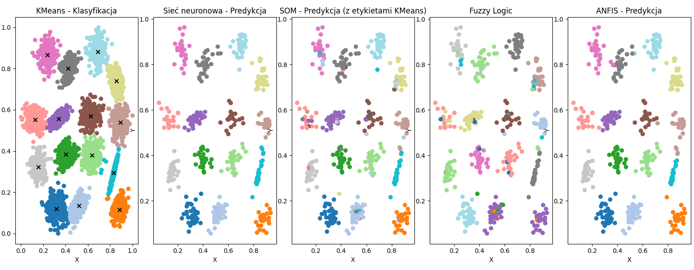
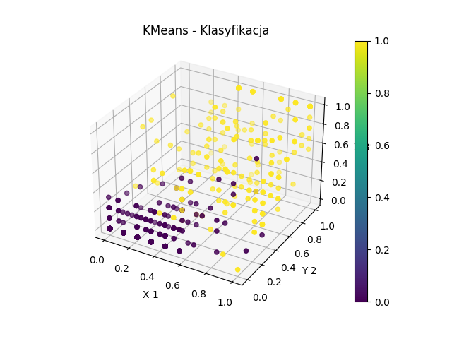
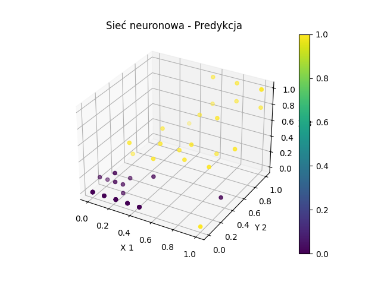
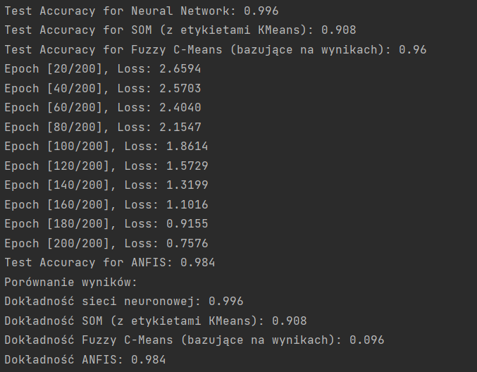

# Hybrid Clustering Models

## Description

This repository implements a hybrid clustering and classification system using various machine learning and AI models, including **KMeans**, **Neural Network**, **SOM (Self-Organizing Map)**, **Fuzzy C-Means**, and **ANFIS (Adaptive Neuro-Fuzzy Inference System)**. Each model is applied to the same dataset to explore and compare their effectiveness, particularly in terms of accuracy. This project is a practical example of leveraging a multi-method approach to clustering, combining different techniques for optimal results.

## Results

### Hybrid Results

### SOM Results

### Fuzzy C-Means Results

### Neural Network

### ANFIS Results

## Overview

The repository uses five main clustering and classification techniques on the same dataset (`S1.txt`) and compares their performance:

1. **KMeans**: Basic clustering with predefined centroids, used as a baseline.
2. **Neural Network**: A simple neural network classifier to categorize the data and assess accuracy.
3. **SOM (Self-Organizing Map)**: Creates a topological map of data, mapping to KMeans clusters.
4. **Fuzzy C-Means**: Consolidates outputs from KMeans, neural network, and SOM to create a hybrid model.
5. **ANFIS (Adaptive Neuro-Fuzzy Inference System)**: Combines fuzzy logic with neural networks for flexible classification.

Each technique is used to classify the data independently, and their results are analyzed to determine which approach is most effective.

## Directory Structure

